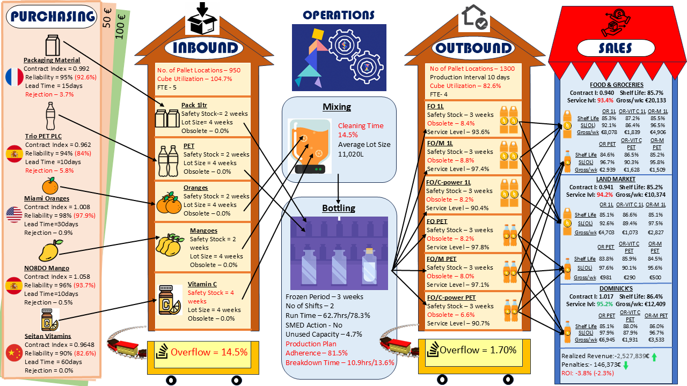
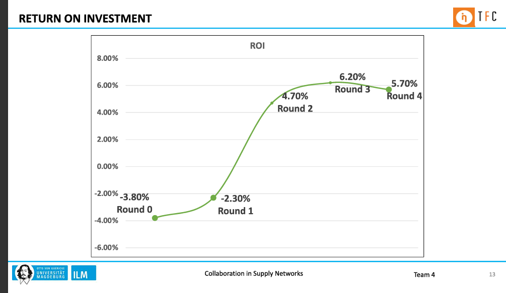
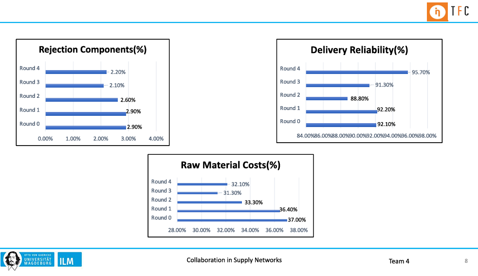

# The Fresh Connection – Supply Chain Simulation


End-to-end strategic supply chain simulation game: procurement, inbound logistics, production, outbound distribution, and sales decisions.  
Optimized trade-offs between cost, service level, and profitability.

---

## ⭐ STAR Summary

- **Situation:** Global fruit juice manufacturer facing declining ROI due to inefficiencies in procurement, bottling operations, and outbound logistics.  
- **Task:** Improve reliability, reduce component rejections, and achieve sustainable profitability while aligning cross-functional supply chain decisions.  
- **Action:** Implemented sourcing strategy, optimized inbound/outbound flows, reduced breakdowns and cleaning times, and refined sales contract management.  
- **Result:** Improved delivery reliability to **95.7%**, reduced raw material costs by **~4%**, cut overflow losses, and turned ROI positive across rounds.

---

## 🔑 Highlights

- Balanced **purchasing, inbound, operations, outbound, and sales** decisions in a dynamic simulation.  
- Reduced **cleaning & breakdown times** to improve production plan adherence.  
- Applied methods: **5 Whys, ROI trend analysis, KPI benchmarking**.  
- Improved **cross-team collaboration** and end-to-end visibility.

---

## 📊 Key Figures

### 1. Supply Chain Map  
  
*Full map of purchasing → inbound → operations → outbound → sales; shows stock, overflow risks, and ROI levers.*

### 2. ROI Trend Over Rounds  
  
*ROI trend across rounds quantifying the effect of strategic changes.*

### 3. Performance Metrics  
  
*Rejection %, Delivery Reliability %, and Raw Material Cost % by round—evidence of measurable improvement.*

---

## 📂 Reports

- 📑 [Download Summary Report (PDF)](docs/reports/FreshConnection_Summary.pdf)  
- 📊 [Download Presentation (PDF)](docs/reports/FreshConnection_Presentation.pdf)  

---

## 📜 Certificate

🔗 [View Certificate](https://game.thefreshconnection.eu/certificate/37MPDXBGZBTV63J7)

---

## 📁 Repository Structure

```bash
docs/
 ├── figures/
 │   ├── 01_SupplyChainMap.png
 │   ├── 02_ROI_Trend.png
 │   └── 03_PerformanceMetrics.png
 └── reports/
     ├── FreshConnection_Summary.pdf
     └── FreshConnection_Presentation.pdf
